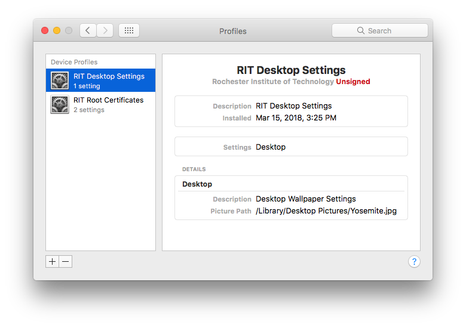
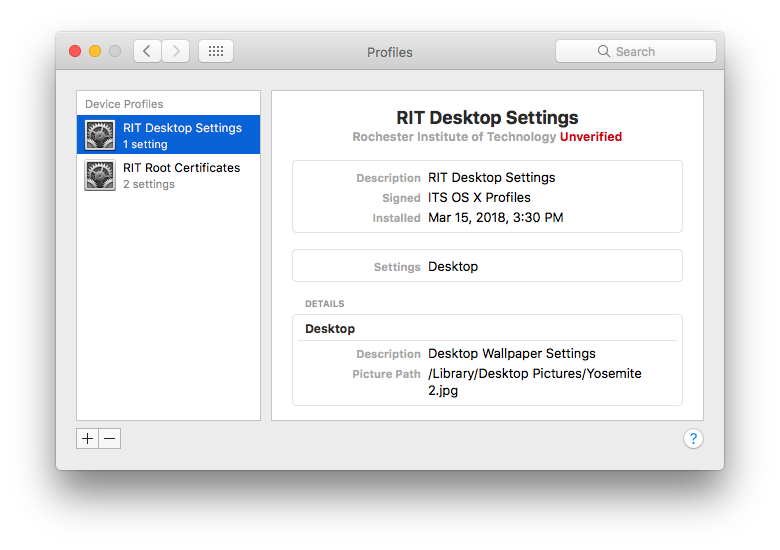
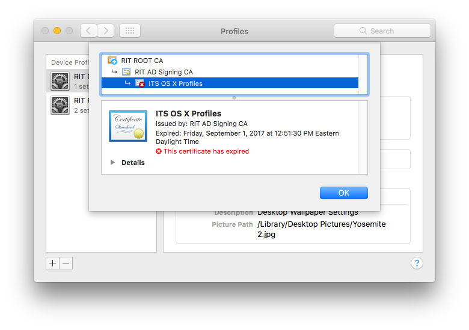
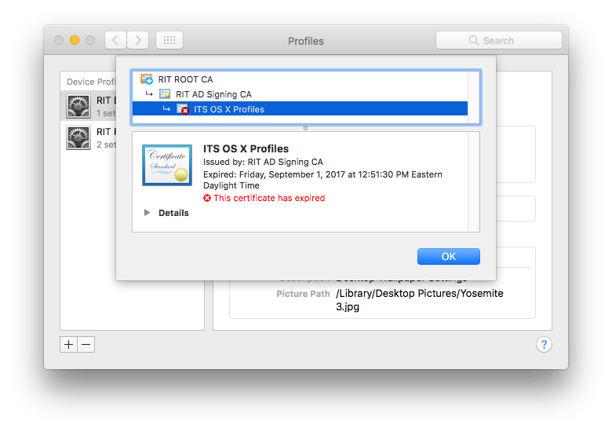
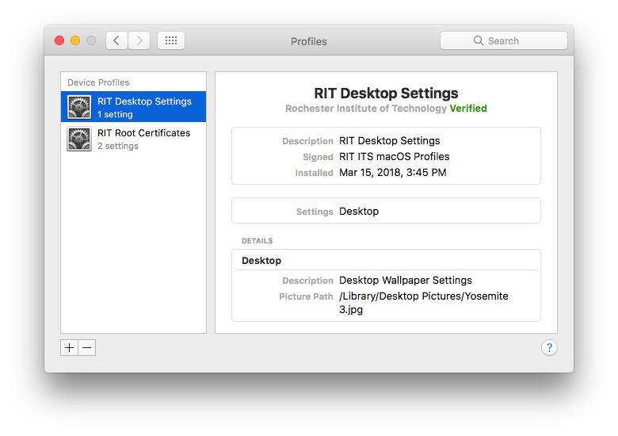
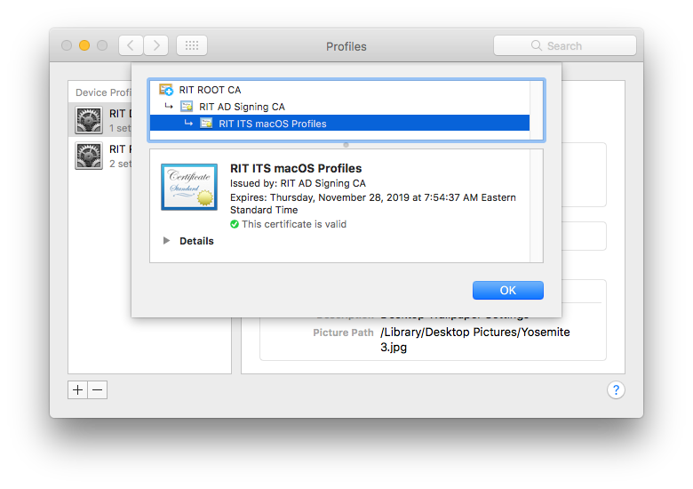

First, we need to install our root certificates for the code signing cert to be trusted by this machine.

`sudo profiles -IF "profiles/edu.rit.certificates.root.mobileconfig"`

Then, let's install our profile unsigned, just to test.

`sudo profiles -IF "profiles/edu.rit.desktop.wallpaper_1.mobileconfig"`



To show a difference in the profiles, I changed the `override-picture-path` key in the profile from `Yosemite.jpg` to `Yosemite 2.jpg`

```xml
			<key>override-picture-path</key>
			<string>/Library/Desktop Pictures/Yosemite 2.jpg</string>
```

Next, I signed the profile with our previous certificate, which is now expired.

`security cms -S -G -H SHA256 -N 'ITS OS X Profiles' -i 'profiles/edu.rit.desktop.wallpaper_1.mobileconfig' -o 'profiles/edu.rit.desktop.wallpaper_2.mobileconfig'`

Now, let's install the newly signed profile.

`sudo profiles -IF "profiles/edu.rit.desktop.wallpaper_2.mobileconfig"`

We see that the Profiles Preference Pane acknowledges the change from `Unsigned` to `Unverifed`



We can see that the reason it is `Unverified` is due to the certificate it was signed with has now expired.



To show a difference in the profiles, I changed the `override-picture-path` key in the profile from `Yosemite 2.jpg` to `Yosemite 3.jpg`

```xml
			<key>override-picture-path</key>
			<string>/Library/Desktop Pictures/Yosemite 3.jpg</string>
```

Next, let's sign the profile with our current certificate.

`security cms -S -G -H SHA256 -N 'RIT ITS macOS Profiles' -i 'profiles/edu.rit.desktop.wallpaper_1.mobileconfig' -o 'profiles/edu.rit.desktop.wallpaper_3.mobileconfig'`

Now, let's install the newly signed profile.

`sudo profiles -IF "profiles/edu.rit.desktop.wallpaper_3.mobileconfig"`




If I completely remove the profile and re-add it, the Profiles Preference Pane shows the updated certificate as expected

```bash
sudo profiles -Rv -p edu.rit.desktop
sudo profiles -IF "profiles/edu.rit.desktop.wallpaper_3.mobileconfig"
```




